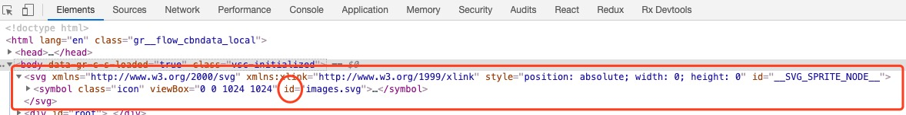

[TOC]

### 导语

在我们前端开发过程中免不了会有使用图标的需求，从最原始的sprite图、到iconfont、到svg sprite，涌现出了许多方案，这些方案在他们所处的时期都是优秀的方案，直到现在各种方案仍旧在各种场景中发挥着作用。加之结合一些前端工程化方案将这以工作自动化以后，在页面上添加图标对前端开发人员来说已经成为十分简单的事。

> Svg的特性和优缺点在各种文章中已经老生常谈，这里总结几点一笔带过：
>
> - 标准制定早(2001年)，主流浏览器兼容性好
> - 可读性好，利于seo
> - 加载性能好
> - 矢量图，无需考虑高清屏失真的问题而准备多个尺寸的图

本文主要涉及前端项目中svg文件的使用方式：

### 一. 将svg转化为React组件

####  [svgr](https://github.com/smooth-code/svgr#readme)
>  Transform SVGs into React components.

本方案将svg转化为component组件，配置webpack loader后，可以直接引入svg文件作为组件使用，下面是配置方法：

1. 安装依赖

```bash
$yarn add --dev @svgr/webpack
# 或
$npm install --save-dev @svgr/webpack
```
2. webpack配置loader处理svg文件

```javascript
  module: {
    rules: [
      {
        test: /\.svg$/,
        use: [
          {
            loader: '@svgr/webpack',
            options: {
              babel: true,
              icon: true,
            }
          }
        ]
      },
     // ...
    ],
     //...
  }
```

3. 使用

```jsx
import Image from '../../assets/svg/images.svg';

// 组件即图片
<Image/>
```

#### 二.  Svg Sprite

>  对svg sprite技术如果之前没有接触过，请参阅大神的[SVG Sprite技术介绍](https://www.zhangxinxu.com/wordpress/2014/07/introduce-svg-sprite-technology/)

1. 安装

```bash
$yarn add svg-sprite-loader -D
# 或
$npm install svg-sprite-loader -D
```

2. webpack配置

```javascript
{
  test: /\.svg$/,
    use: [
      {
        loader: 'svg-sprite-loader',
        options: {
          symbolId: filePath => path.basename(filePath),  // id 生成方式
        }
      },
      'svg-fill-loader',
      'svgo-loader'
    ]
},
```

3. 如何使用

打包后的index.html中会注入一个svg标签，用symbol的方式聚合了引入的所有的svg，每一个symbol按我们定义的方式生成了id：



我们可以在页面中用use的方式引用svg图片：

```javascript
<svg class="size"><use xlink:href="#target" /></svg>
```

4. 在实际开发中，我们将上述引用过程封装成组件：

```javascript
// Icon.jsx
import * as React from 'react';

class Icon extends React.Component {
  render() {
    const { id, styles, color } = this.props;
    return (
    	<span styles={{...styles, color}}>
      	<svg style={{fill: 'currentColor'}}><use xlinkHref={id} /></svg>
      </span>
    );
  }
}

// usage
import '/path/to/images.svg'; // 使用前先引入
//...
<Icon id="images.svg" />
```

```vue
// icon.vue
<template>
	<span class="my-svg-icon" :style="`color:${color || '#000'}`">
  	<svg :xlink:href="id"></svg>
  </span>
</template>

<script>
  export default {
    name: 'icon',
    props: ['id', 'color'],
  }
</script>

<style lang="scss">
  .my-svg-icon {
    > svg {
      fill: 'currentColor';
    }
  }
</style>
```

5. 其他注意点

- 我们使用了currentColor，即取svg父元素的颜色来定义svg的颜色，所以对于多色图标有改变颜色需求时可能会不太好处理，如果彩色svg图没有变换色彩的需求，可以在svg文件中包含色彩样式定义。
- 建议将svg文件的引入放在一个文件中统一维护，方便管理。
- 如果使用的是`typescript`，直接引入`.svg`格式文件会通不过编译，需要在全局增加如下声明：

```javascript
// index.t.ts
declare module '*.svg' {
  const content: any;
  export default content;
}
```

// 待续...