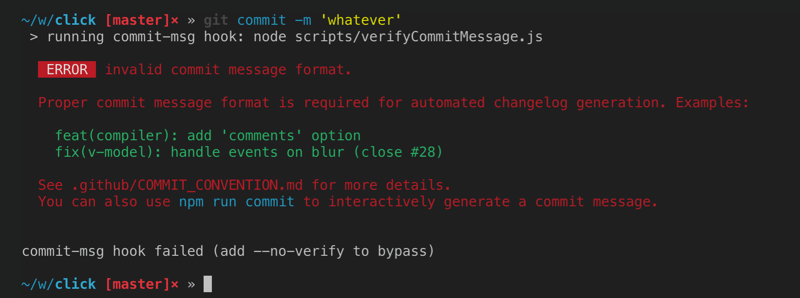

### 项目探索

#### Lerna.js
管理多package项目，在一个仓库管理多个npm packages 的一种方案。

### cli 开发常用 npm 包
- `slash` 把 windows的反斜杠路径转成unix格式的文件路径格式
- `semver` node 版本的语义化版本控制
- `minimist` 解析命令行参数
- `commander` 为快速开发命令行工具提供模板
- `chalk` 颜色显示

### linux awk 基本应用
> 模式-动作语句  pattern { action }
在 awk 中仅仅只有两种数据类型: 数值 和 字符构成的字符串
Awk 程序一次从输入文件的中读取一行内容并把它分割成一个个字段, 通常默认情况下, 一个字段是一个不包含任何空格或制表符的连续字符序列. 当前输入的行中的第一个字段被称做 $1, 第二个是 $2, 以此类推. 整个行的内容被定 义为 $0. 每一行的字段数量可以不同.
文档 https://awk.readthedocs.io/en/latest/chapter-one.html

```bash
//emp.data
Beth	4.00	0
Dan	3.75	0
kathy	4.00	10
Mark	5.00	20
Mary	5.50	22
Susie	4.25	18
```
> emp.data 是 一个包含这类信息的典型文件 – 混合了被空格和(或)制表符分割的数字和词语.

```bash
$ awk '$3 > 0 { print $1, $2 * $3 }' emp.data
# Kathy 40
# Mark 100
# Mary 121
# Susie 76.5


awk '$3 == 0 { print $1 }' emp.data
# Beth
# Dan

awk '$3 == 0 { print NF, $1, $NF }' emp.data
# 3 Beth 0
# 3 Dan 0
# 3 Dan 0
# NF : 行字段数 = 3, $NF : $3 也即最后一个字段

awk '{ print NR, $0 }' emp.data
# 给每一行显示行号
# NR 内建变量 读取的行数

awk '{ print "total pay for", $1, "is", $2 * $3 }' emp.data
# total pay for Beth is 0
# total pay for Dan is 0
# total pay for Dan is 0
# total pay for kathy is 40
# total pay for Mark is 100
# total pay for Mary is 121
# total pay for Susie is 76.5

awk '$2 > 4 || $3 >= 20 { print "total pay for", $1, "is", $2 * $3 }' emp.data
# total pay for Mark is 100
# total pay for Mary is 121
# total pay for Susie is 76.5

awk '!($2 < 5 && $3 < 20) { print "total pay for", $1, "is", $2 * $3 }' emp.data
# total pay for Mark is 100
# total pay for Mary is 121


awk '{ printf("total pay for %s is $%.2f\n", $1, $2 * $3) }' emp.data
# printf 不会自动产生空格或者新的行，必须是你自己来创建，所以不要忘了 \n 。


awk '{ printf("%6.2f    %s\n", $2 * $3, $0) }' emp.data | sort
# 行文本按ASCII码值进行排序后输出

awk 'BEGIN {print "name  rate  hours  total"}; $3 > 0 { print $1, $2, $3, $2 * $3 }' emp.data
# BEGIN 用于匹配第一个输入文件的第一行之前的位置， 比如插入一个表头

awk '$3 > 15 { emp = emp + 1 };END { print emp, "employees worked more than 15 hours" }' emp.data


awk '$2 > maxrate { maxrate = $2; maxemp = $1 }; END { print "highest hourly rate:", maxrate, "for", maxemp }' emp.data

BRANCH=`git branch | awk '$1="*" {print $2}'`
echo $BRANCH
# 获取并打印当前git分支名
```
> 模式摘要
>
> 1. BEGIN { 语句 }
>    在读取任何输入前执行一次 语句
> 2. END { 语句 }
>    读取所有输入之后执行一次 语句
> 3. 表达式 { 语句 }
>    对于 表达式 为真（即，非零或非空）的行，执行 语句
> 4. /正则表达式/ { 语句 }
>    如果输入行包含字符串与 正则表达式 相匹配，则执行 语句
> 5. 组合模式 { 语句 }
>    一个 组合模式 通过与（&&），或（||），非（|），以及括弧来组合多个表达式；对于组合模式为真的每个输入行，执行 语句
> 6. 模式1，模式2 { 语句 }
>    范围模式(range pattern)匹配从与 模式1 相匹配的行到与 模式2 相匹配的行（包含该行）之间的所有行，对于这些输入行，执行 语句 。
>    BEGIN和END不与其他模式组合。范围模式不可以是任何其他模式的一部分。BEGIN和END是仅有的必须搭配动作的模式。


### 代码片段
#### NodeJS V10 核心模块， readline
```javascript
const readline = require('readline');

const rl = readline.createInterface({
  input: process.stdin,
  output: process.stdout
});

// 询问是否退出
rl.on('SIGINT', () => {
  rl.question('确定要退出吗？', (answer) => {
    if (answer.match(/^y(es)?$/i)) rl.pause();
  });
});

// 问题收集
rl.question('你最喜欢的食物是什么？', (answer) => {
  console.log(`你最喜欢的食物是 ${answer}`);
});

// 清除光标左右或者整行内容
rl.clearLine(stream, dir) // dir 0 | -1 | 1

// 将光标移动到指定位置
rl.cursorTo(stream, x, y)

// 清除光标位置往下的内容
rl..clearScreenDown(stream);

```

```javascript
// 逐行读取文件
const readline = require('readline');
const fs = require('fs');

const rl = readline.createInterface({
  input: fs.createReadStream('sample.txt'),
  crlfDelay: Infinity
});

rl.on('line', (line) => {
  console.log(`文件的每行内容：${line}`);
});
```


#### 小技巧

#### 1. 用gitHooks约束 commit message
之前有用过，这周看 vue-cli 源码发现了又如下的 verify commit message 逻辑，觉得挺实用的，特别适合对项目有追求的强迫症患者或者多人合作的项目约束风格的统一。
```javascript
const chalk = require('chalk')  // eslint-disable-line
const msgPath = process.env.GIT_PARAMS
const msg = require('fs').readFileSync(msgPath, 'utf-8').trim()

const commitRE = /^(v\d+\.\d+\.\d+(-(alpha|beta|rc.\d+))?)|((revert: )?(feat|fix|docs|style|refactor|perf|test|workflow|ci|chore|types)(\(.+\))?!?: .{1,50})/

if (!commitRE.test(msg)) {
  console.log()
  console.error(
    `  ${chalk.bgRed.white(' ERROR ')} ${chalk.red(`invalid commit message format.`)}\n\n` +
    chalk.red(`  Proper commit message format is required for automated changelog generation. Examples:\n\n`) +
    `    ${chalk.green(`feat(compiler): add 'comments' option`)}\n` +
    `    ${chalk.green(`fix(v-model): handle events on blur (close #28)`)}\n\n` +
    chalk.red(`  See .github/COMMIT_CONVENTION.md for more details.\n`) +
    chalk.red(`  You can also use ${chalk.cyan(`npm run commit`)} to interactively generate a commit message.\n`)
  )
  process.exit(1)
}
```
> 脚本的作用是限制 commit 信息必须是 `feat|fix|docs|style|refactor|perf|test|workflow|ci|chore|types`打头，或者版本号开头，看vue-cli的提交记录更直观


要使上面的逻辑生效，我们还需要安装 [yorkie](https://github.com/yyx990803/yorkie)
```javascript
npm install yorkie --save-dev
```
然后在项目的 package.json 中加入以下配置
```json
{
  "gitHooks": {
    "commit-msg": "node scripts/verifyCommitMessage.js"
  },
}
```

到此我们就配置完成了

配置完成后我们要是不按照约定的格式书写commit message，提交就会被挡住，看下图：



> 相关原理可以参看 [Git hooks](https://git-scm.com/book/zh/v2/%E8%87%AA%E5%AE%9A%E4%B9%89-Git-Git-%E9%92%A9%E5%AD%90)，我们引入的第三方库安装后会在仓库的`.git/hooks`目录下为我们设置一些hooks脚本，这些hooks脚本的任务是接管我们的node或shell脚本，使其在正确的时机执行，为我们隐藏了直接自己在./git/hooks路径下编写hook脚本的复杂性

> 你还可以指定在commit前做一些预处理(pre-commit)，比如执行eslint，对git提交做进一步的规范和约束，详细用法请阅读文档。
>
> 类似的工具还有 [husky](https://github.com/typicode/husky)

#### 2. `npm home`
1. 快速打开一个npm项目的首页 `npm home react`
2. 快速打开当前项目的仓库地址  `npm home .`
